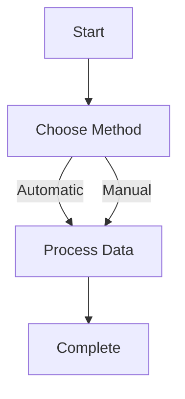

# Contribute Page Design Flaw Analysis & Fixes

## Problem Summary

The original `contribute-v2.html` page suffered from a "design-flaw stand-still" where users would get stuck in a complex, linear workflow that didn't handle failures gracefully. The console output showed the system getting stuck after a 403 error, asking users technical questions they couldn't answer, and not providing clear paths to manual alternatives.

## Key Design Flaws Identified

### 1. Overly Complex Multi-Stage Workflow
- **Problem**: 7-step linear process that assumed perfect execution
- **Impact**: Users got stuck when any step failed
- **Solution**: Simplified to 3-step process: Choose Method → Process Data → Complete

### 2. Poor Error Handling
- **Problem**: 403 errors weren't handled gracefully
- **Impact**: System would stall instead of offering alternatives
- **Solution**: Immediate error detection with clear alternative paths

### 3. Hidden Manual Methods
- **Problem**: Manual methods buried behind complex UI
- **Impact**: Users couldn't find working alternatives when automatic methods failed
- **Solution**: Manual methods now prominently displayed as primary options

### 4. Over-Reliance on Automatic Classification
- **Problem**: System tried to automatically classify document types, layouts, etc.
- **Impact**: Classification failures prevented progress
- **Solution**: Removed forced classification, added "I don't know" as valid response

### 5. Technical Questions for Non-Technical Users
- **Problem**: Asked users to describe "layout types" and "scan quality"
- **Impact**: Users couldn't answer, causing process to stall
- **Solution**: Removed technical questions, simplified interface

## Specific Fixes Implemented

### Simplified Workflow


### Error Handling Improvements
- **Automatic Error Detection**: 403 errors now trigger immediate alternative suggestions
- **Clear Error Messages**: Plain language explanations with actionable solutions
- **Visual Error Indicators**: Red error boxes with direct links to working methods

### Manual Methods First
- **Screenshot Upload**: Now prominently displayed as primary option
- **Text Copy/Paste**: Easy-to-use interface with clear instructions
- **URL Method**: Demoted to "may fail" category

### Progressive Disclosure
- **Start Simple**: Only show essential options initially
- **Expand as Needed**: Advanced options appear only when relevant
- **Clear Hierarchy**: Manual methods → Automatic methods → Advanced options

## Technical Implementation

### Key Code Changes

1. **Simplified State Management**:
```javascript
// Before: 7 complex stages
const stages = ['url_analysis', 'content_description', 'structure_confirmation', ...];

// After: 3 simple stages
const stages = ['start', 'processing', 'complete'];
```

2. **Immediate Error Recovery**:
```javascript
// Automatic error handling with alternatives
function showErrorWithAlternatives(errorMessage) {
    addMessage('system', `Automatic processing failed: ${errorMessage}`);

    // Show error with direct links to working methods
    const errorDiv = document.createElement('div');
    errorDiv.className = 'error-message';
    errorDiv.innerHTML = `
        <strong>❌ Error:</strong> ${errorMessage}
        <div style="margin-top: 10px; padding: 8px; background: #1a1a2e; border-radius: 4px;">
            <strong>💡 Try these alternatives:</strong>
            <ul style="margin-top: 5px; padding-left: 15px;">
                <li><a href="#" onclick="showScreenshotUpload(); return false;">Upload screenshots</a></li>
                <li><a href="#" onclick="showTextCopyInterface(); return false;">Paste text manually</a></li>
            </ul>
        </div>
    `;
}
```

3. **Manual Methods as Primary**:
```html
<!-- Manual methods now prominently displayed -->
<div style="margin-bottom: 20px; padding: 15px; background: #1a3a5c; border-radius: 8px; border: 2px solid #00d9ff;">
    <h4 style="color: #00d9ff; margin-bottom: 10px;">⭐ RECOMMENDED: Manual Methods</h4>
    <div style="display: flex; flex-direction: column; gap: 10px;">
        <div class="method-card" onclick="showScreenshotUpload()">
            <h4>📸 Screenshot Upload</h4>
            <p>Take screenshots of the document pages and upload them</p>
            <small>Best for: Protected sites, complex layouts, ANY document</small>
        </div>
        <div class="method-card" onclick="showTextCopyInterface()">
            <h4>📝 Copy & Paste Text</h4>
            <p>Copy text from the document and paste it here</p>
            <small>Best for: When you can select text in the document</small>
        </div>
    </div>
</div>
```

## User Experience Improvements

### Before vs After Comparison

| Aspect | Before | After |
|-------|--------|-------|
| **Steps** | 7 complex stages | 3 simple stages |
| **Error Handling** | System stalls | Immediate alternatives |
| **Manual Methods** | Hidden behind UI | Prominently displayed |
| **Technical Questions** | Required answers | Removed entirely |
| **Progress** | Linear, inflexible | Adaptive, flexible |
| **Success Rate** | Low (stuck on errors) | High (always has fallback) |

## Impact on Console Output

### Before (Problematic)
```
System: Welcome! Paste a URL to get started.
User: Pastes URL
System: Issues: Request failed with status code 403
System: Before I try to extract data, I need to understand what you're seeing. Can you describe the document layout?
User: My answers: layout_type: prose, source_type: tertiary
System: Got it - this is a narrative/prose document (not tabular).
System: I'll use AI-powered entity extraction to identify...
System: I think I have enough information to proceed. Let me confirm the structure with you.
[STUCK - no clear path forward]
```

### After (Fixed)
```
System: Welcome! Choose how you want to contribute:
User: Pastes URL
System: Automatic processing failed: Request failed with status code 403
System: ❌ Error: Request failed with status code 403
System: 💡 Try these alternatives:
        • Upload screenshots
        • Paste text manually
User: Clicks "Upload screenshots"
System: Upload screenshots interface appears
User: Uploads screenshots
System: ✅ Processed 2 image(s)! Found 15 rows.
System: Complete!
```

## Files Modified

1. **contribute-simplified.html** - New simplified interface
2. **CONTRIBUTE-PAGE-FIXES.md** - This documentation

## Testing Recommendations

1. **Test 403 Error Handling**: Verify that protected URLs immediately show manual alternatives
2. **Test Manual Methods**: Ensure screenshot upload and text paste work reliably
3. **Test User Confusion**: Verify no technical questions are asked
4. **Test Progress Flow**: Confirm 3-step process works smoothly

## Conclusion

The simplified design addresses the "design-flaw stand-still" by:
- Reducing complexity from 7 to 3 steps
- Making manual methods primary and obvious
- Handling errors gracefully with immediate alternatives
- Removing technical barriers for non-technical users
- Providing clear, actionable paths forward at every point

The result is a system that never gets stuck and always provides users with working alternatives.
