# Cline Setup Guide: Memory Bank Integration

**Purpose:** Configure Cline AI assistant in VS Code to use the Memory Bank system for persistent context across development sessions.

**Benefits:**
- ✅ No context loss between sessions
- ✅ Cline remembers project architecture
- ✅ Faster development (no repetitive explanations)
- ✅ Better decision-making with full context
- ✅ Consistent coding patterns

---

## Prerequisites

1. **VS Code Installed:** Version 1.80+
2. **Cline Extension Installed:** Search "Cline" in VS Code extensions
3. **Claude API Key:** From Anthropic Console (https://console.anthropic.com)
4. **Memory Bank Files:** Already created in `memory-bank/` directory

---

## Step 1: Install Cline Extension

### Option A: VS Code Marketplace
1. Open VS Code
2. Click Extensions icon (⌘+Shift+X / Ctrl+Shift+X)
3. Search for "Cline"
4. Click "Install" on the official Cline extension
5. Restart VS Code

### Option B: Command Line
```bash
code --install-extension saoudrizwan.claude-dev
```

---

## Step 2: Configure Cline API Key

1. Open Cline sidebar (click Cline icon in left sidebar)
2. Click "Settings" gear icon
3. Select "API Provider": **Anthropic**
4. Enter your **Claude API Key**
5. Select **Model**: `claude-sonnet-4.5` (recommended) or `claude-opus-4`
6. Click "Save"

**Get API Key:**
- Visit https://console.anthropic.com
- Navigate to "API Keys"
- Create new key with name "Cline Development"
- Copy key and paste into Cline settings

---

## Step 3: Add Custom Instructions (Memory Bank Integration)

### 3.1 Open Custom Instructions
1. In Cline sidebar, click "Settings" gear icon
2. Scroll to "Custom Instructions" section
3. Click "Edit Custom Instructions"

### 3.2 Paste Memory Bank Instructions

Copy and paste the following into the Custom Instructions field:

```markdown
# Memory Bank System - Reparations Platform

You are working on the Reparations Is A Real Number platform. This project uses a Memory Bank system for persistent context.

## Memory Bank Files (ALWAYS READ FIRST)

Before starting any task, READ these files in order:

1. **memory-bank/projectbrief.md** - Source of truth (vision, goals, constraints)
2. **memory-bank/activeContext.md** - Current state, recent changes, immediate next steps
3. **memory-bank/progress.md** - Feature status, roadmap, completed work
4. **memory-bank/productContext.md** - User personas, workflows, ethical considerations (if needed)
5. **memory-bank/systemPatterns.md** - Architecture patterns, design decisions (if needed)
6. **memory-bank/techContext.md** - Tech stack, dependencies, deployment (if needed)

## Workflow


## Rules

1. **ALWAYS read Memory Bank first:** Before writing any code, read at minimum: projectbrief.md, activeContext.md, progress.md

2. **Update activeContext.md after changes:** Every significant change must update "Last Updated" and "Recent Changes" section

3. **Update progress.md for milestones:** When completing a feature, update the relevant section in progress.md

4. **Follow existing patterns:** Check systemPatterns.md for architectural decisions before implementing

5. **Respect constraints:** Honor decisions in projectbrief.md (e.g., S3 storage, file type detection)

6. **Ask questions:** If Memory Bank is unclear or conflicts, ask user before proceeding

7. **No reinventing the wheel:** If a pattern exists in systemPatterns.md, use it

## Example Session

### Bad Approach ❌
```
User: "Add a new API endpoint for exporting documents"
Cline: [Immediately starts writing code without reading Memory Bank]
Result: Code doesn't follow project patterns, misses security considerations
```

### Good Approach ✅
```
User: "Add a new API endpoint for exporting documents"
Cline: [Reads projectbrief.md, activeContext.md, progress.md]
Cline: [Reads systemPatterns.md to understand error handling, auth patterns]
Cline: [Reads techContext.md to check database schema, API structure]
Cline: "I see the project uses JWT auth (not yet implemented) and follows RESTful patterns.
        I'll add the endpoint at /api/documents/:documentId/export with:
        - Rate limiting (express-rate-limit pattern)
        - Input validation (Joi pattern from techContext.md)
        - Error handling (global middleware pattern)
        - Response format matching existing endpoints"
Cline: [Implements following established patterns]
Cline: [Updates activeContext.md with new endpoint documentation]
Result: Code follows project standards, integrates seamlessly
```

## Common Tasks & Required Reading

| Task | Required Reading |
|------|-----------------|
| Bug fix in existing code | projectbrief.md, activeContext.md |
| New API endpoint | activeContext.md, systemPatterns.md, techContext.md |
| Database schema change | techContext.md, systemPatterns.md (transaction pattern) |
| Deployment issue | activeContext.md, techContext.md (deployment section) |
| New feature | All 6 files |
| Refactoring | systemPatterns.md, techContext.md |
| Security implementation | systemPatterns.md (security patterns), techContext.md |
| Frontend change | productContext.md (user workflows), techContext.md |

## Context Refresh

If you lose context mid-session:
1. Re-read activeContext.md (current state)
2. Re-read progress.md (what's been done)
3. Ask user: "Where were we?" if still unclear

## Memory Bank Updates

When to update each file:

- **projectbrief.md:** Rarely (only major vision/goal changes)
- **activeContext.md:** Frequently (every significant change)
- **progress.md:** Weekly or per milestone
- **productContext.md:** When user personas or workflows change
- **systemPatterns.md:** When establishing new architectural patterns
- **techContext.md:** When dependencies or infrastructure changes

## Cline-Specific Tips

1. **Use /file command:** `/file memory-bank/activeContext.md` to quickly reference
2. **Use /search:** `/search "S3 upload"` to find relevant code
3. **Use /problems:** Check for errors before updating Memory Bank
4. **Use /git:** Commit changes with meaningful messages referencing Memory Bank updates

## Critical Reminders

⚠️ **NEVER skip reading Memory Bank** - Even if you think you remember, context may have changed
⚠️ **ALWAYS update activeContext.md** - Future you (or another AI) depends on it
⚠️ **RESPECT DECISIONS** - If systemPatterns.md says "use PostgreSQL", don't suggest MongoDB
⚠️ **ASK BEFORE MAJOR CHANGES** - If considering a pattern not in Memory Bank, discuss with user first
```

---

## Step 4: Save and Test

1. Click "Save" in Custom Instructions dialog
2. Close settings
3. Start a new conversation in Cline
4. Test with: "Read the Memory Bank and summarize the current project state"
5. Verify Cline reads the files and provides accurate summary

---

## Memory Bank Workflow Diagram


---

## Memory Bank File Relationships

```mermaid
graph LR
    subgraph "Core Documentation"
        PB[projectbrief.md<br/>📋 Source of Truth]
        AC[activeContext.md<br/>⚡ Current State]
        PR[progress.md<br/>📊 Feature Tracker]
    end

    subgraph "Detailed Context"
        PC[productContext.md<br/>👥 User Perspective]
        SP[systemPatterns.md<br/>🏗️ Architecture]
        TC[techContext.md<br/>⚙️ Technical Stack]
    end

    PB -.->|Informs| AC
    PB -.->|Drives| PR
    PB -.->|Guides| PC
    PB -.->|Constrains| SP
    PB -.->|Defines| TC

    AC -->|Updates| PR
    AC -.->|References| SP
    AC -.->|References| TC

    PC -.->|Shapes| SP
    SP -.->|Requires| TC

    style PB fill:#ff6b6b,color:#fff
    style AC fill:#4ecdc4,color:#fff
    style PR fill:#45b7d1,color:#fff
    style PC fill:#96ceb4
    style SP fill:#ffeaa7
    style TC fill:#dfe6e9
```



---

## Best Practices

### DO ✅
1. **Start Every Session with Memory Bank:** Read at minimum projectbrief.md, activeContext.md, progress.md
2. **Update activeContext.md Immediately:** After every significant change
3. **Follow Established Patterns:** Check systemPatterns.md before implementing
4. **Ask Questions:** If Memory Bank conflicts or is unclear
5. **Test Before Updating:** Ensure changes work before documenting
6. **Commit Frequently:** Git commits with references to Memory Bank updates
7. **Use Descriptive Messages:** "Fixed S3 upload bug (see activeContext.md)"

### DON'T ❌
1. **Skip Reading Memory Bank:** Even if you think you remember
2. **Implement Without Context:** Always check existing patterns first
3. **Make Assumptions:** If unsure, ask user or check Memory Bank
4. **Ignore Constraints:** Decisions in projectbrief.md are binding
5. **Forget to Update:** activeContext.md must stay current
6. **Mix Concerns:** Each Memory Bank file has a specific purpose
7. **Override Patterns:** If changing architecture, update systemPatterns.md first

---

## Common Scenarios

### Scenario 1: New Feature Request
```
User: "Add a user profile page"

Cline Actions:
1. ✅ Read projectbrief.md (understand project vision)
2. ✅ Read activeContext.md (check current state, blockers)
3. ✅ Read progress.md (verify feature not already done)
4. ✅ Read productContext.md (understand user personas)
5. ✅ Read systemPatterns.md (check auth patterns - JWT not implemented!)
6. ✅ Ask user: "I see JWT auth is planned but not implemented. Should I:
   A) Implement JWT auth first, then user profiles?
   B) Create user profiles without auth (temporary)?
   C) Wait for auth implementation?"
7. ✅ Implement based on user choice
8. ✅ Update activeContext.md with new feature
9. ✅ Update progress.md feature status
```

### Scenario 2: Bug Fix
```
User: "Documents are returning 404 on download"

Cline Actions:
1. ✅ Read activeContext.md (check recent changes - S3 migration!)
2. ✅ Read techContext.md (check S3 configuration)
3. ✅ Examine code: server.js /api/documents/:documentId/file endpoint
4. ✅ Identify issue: File path format changed (local → S3 key)
5. ✅ Fix: Update path resolution logic
6. ✅ Test: Verify download works
7. ✅ Update activeContext.md: "Fixed document download 404 - S3 key resolution"
8. ✅ Commit: "Fix document download 404 after S3 migration (activeContext.md updated)"
```

### Scenario 3: Deployment Issue
```
User: "Render deployment is failing"

Cline Actions:
1. ✅ Read activeContext.md (check recent deployments section)
2. ✅ See: "3 failed deployments due to file-type v16 issue - FIXED"
3. ✅ Read techContext.md (check deployment configuration)
4. ✅ Ask user: "Can you share the deployment logs?"
5. ✅ Analyze logs with context from Memory Bank
6. ✅ Compare to previous fixes in activeContext.md
7. ✅ Implement solution
8. ✅ Update activeContext.md deployment timeline
9. ✅ Update progress.md if milestone affected
```

---

## Troubleshooting

### Problem: Cline Doesn't Read Memory Bank
**Solution:**
1. Check Custom Instructions are saved
2. Restart Cline (close and reopen sidebar)
3. Start new conversation (old conversations don't have new instructions)
4. Manually ask: "Read the Memory Bank files in the memory-bank/ directory"

### Problem: Cline Reads Wrong Files
**Solution:**
1. Verify files are in `memory-bank/` directory
2. Check file names match exactly (case-sensitive)
3. Ensure files have `.md` extension
4. Try absolute paths in Custom Instructions if needed

### Problem: Cline Forgets Context Mid-Session
**Solution:**
1. Ask: "Re-read activeContext.md to refresh your memory"
2. Provide specific file: "Check memory-bank/systemPatterns.md for the error handling pattern"
3. Start new conversation if context is severely degraded

### Problem: Custom Instructions Too Long
**Solution:**
- Current instructions are optimized for length
- If Anthropic updates limits, prioritize: workflow diagram, rules, file list
- Remove "Example Session" section if needed

---

## Advanced Usage

### Multi-File Changes
When making changes across multiple files:
1. Read all relevant Memory Bank files first
2. Plan changes with references to Memory Bank
3. Implement changes
4. Update activeContext.md with all affected files
5. Create single git commit with comprehensive message

### Refactoring Sessions
For large refactoring:
1. Read systemPatterns.md thoroughly
2. Identify pattern being changed
3. Update systemPatterns.md with new pattern FIRST
4. Implement refactoring following new pattern
5. Update activeContext.md with refactoring details
6. Update progress.md with "Technical Debt" section changes

### Emergency Fixes
For critical production bugs:
1. Quick read: activeContext.md only (current state)
2. Implement fix
3. Test thoroughly
4. Update activeContext.md with "Known Issues" section
5. Create follow-up task in progress.md for proper solution

---

## Next Steps

Now that Cline is configured:

1. **Test the Setup:**
   ```
   Ask Cline: "Read the Memory Bank and tell me the current project status"
   ```

2. **Start Development:**
   ```
   Ask Cline: "Based on activeContext.md, what should we work on next?"
   ```

3. **Triage Deployment:**
   ```
   Ask Cline: "Read activeContext.md and help me triage the Render deployment failure"
   ```

4. **Iterate and Improve:**
   - Update Memory Bank as project evolves
   - Refine Custom Instructions based on experience
   - Keep activeContext.md current for best results

---

## Additional Resources

- **Cline Documentation:** https://github.com/cline/cline
- **Anthropic API Docs:** https://docs.anthropic.com
- **Memory Bank Blog Post:** memory-bank/MEMORY-BANK-BLOG-POST.pdf (original concept)
- **Project Documentation:** CLAUDE.md (repository-specific guidance)

---

## Support

If you encounter issues:
1. Check Cline GitHub Issues: https://github.com/cline/cline/issues
2. Review Memory Bank files for conflicts or outdated info
3. Ask in project discussions
4. Update this guide with solutions

---

**🎉 You're Ready!** Cline is now configured with Memory Bank integration. Start a conversation and watch Cline maintain perfect context across all development sessions.
